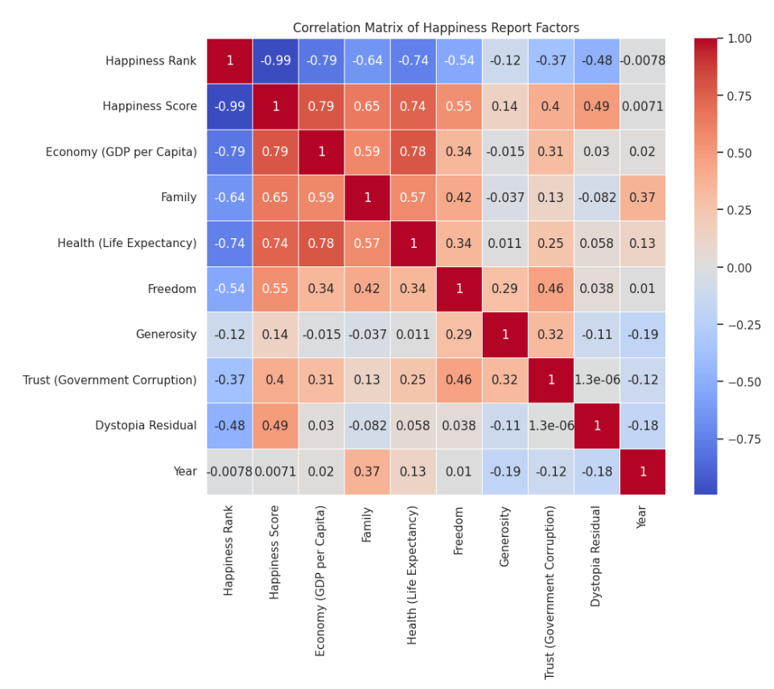
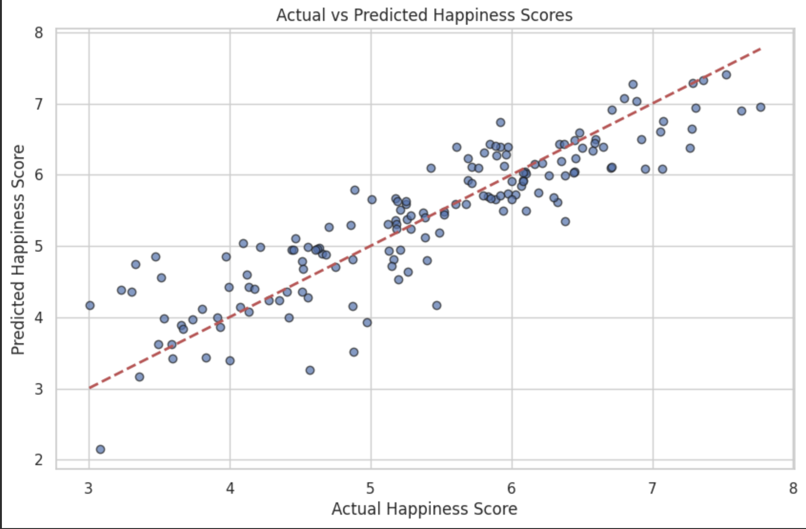
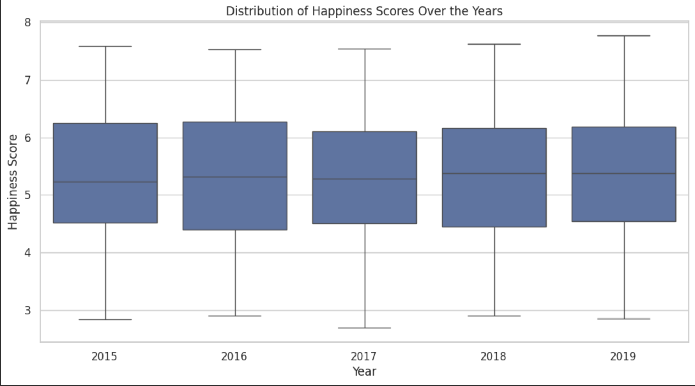

# Analyzing the Determinants of Happiness (2015-2019)

## Project Overview
This project analyzes the **key factors influencing happiness** across countries from **2015 to 2019** using data from the **World Happiness Report**. By examining economic, social, and health-related indicators, we aim to understand:
- The **main determinants of happiness** across nations.
- How these determinants **change over time**.
- The **countries with the highest and lowest happiness scores**, and what influences them.
- The **correlation between economic factors** (such as GDP per capita) and happiness compared to health, freedom, and social support.

This analysis provides insights that can **guide policymakers** in improving societal well-being.


## Research Questions
1. What are the **main factors** influencing happiness across countries?
2. How have these factors **changed over the years** (2015-2019)?
3. Which countries have the **highest and lowest happiness scores**, and why?
4. How strong is the correlation between **economic factors** (GDP per capita) and happiness compared to other variables like **health, freedom, and social support**?


## Dataset
We use the **World Happiness Report** datasets from **Kaggle**:  
🔗 [World Happiness Report on Kaggle](https://www.kaggle.com/datasets/unsdsn/world-happiness)

### **Key Variables:**
- `Country`: Name of the country
- `Region`: Geographical region (for some years)
- `Happiness Rank`: The ranking of happiness by country
- `Happiness Score`: The overall happiness score
- `Economy (GDP per Capita)`: Economic prosperity measure
- `Family`: Social support measure
- `Health (Life Expectancy)`: Life expectancy metric
- `Freedom`: Freedom to make life choices
- `Trust (Government Corruption)`: Perceived corruption in government
- `Generosity`: Donations and volunteering behavior


## Project Structure

```
/happiness-analysis
│── /data/                     # Raw and processed datasets
│    ├── 2015.csv
│    ├── 2016.csv
│    ├── 2017.csv
│    ├── 2018.csv
│    ├── 2019.csv
│── /src/                      # Python scripts for analysis
│    ├── data_cleaning.py       # Handles missing values & fixes inconsistencies
│    ├── data_merging.py        # Merges datasets into one DataFrame
│    ├── exploratory_analysis.py # Exploratory data analysis (EDA)
│    ├── correlation_analysis.py # Correlation analysis between factors
│    ├── regression_model.py    # Regression model predicting happiness scores
│── /notebooks/                 # Jupyter Notebooks
│    ├── happiness_analysis.ipynb  # Full Jupyter notebook report
│── /docs/                      #  visualizations
│    ├── correlation_matrix.png      # Heatmap visualization
│    ├── actual_vs_predicted.png     # Scatter plot of actual vs predicted scores
│    ├── happiness_distribution.png  # Boxplot of happiness scores
│── .gitignore                  # Ignore unnecessary files
│── README.md                   # Documentation
│── LICENSE                     # Open-source license (optional)
│── requirements.txt             # Dependencies
│── Makefile                     #  Automate script execution
```

---

## Key Visualizations

### **Correlation Between Happiness Factors**
This heatmap visualizes the relationships between key happiness indicators.



---

### **Actual vs Predicted Happiness Scores**
A scatter plot comparing the actual and predicted happiness scores from the regression model.



---

### **Happiness Score Distribution Over Time**
This boxplot shows how happiness scores have changed across the years.




## Installation & Setup

### **1️⃣ Clone the repository**
```bash
git clone https://github.com/Melasery/happiness-analysis.git
cd happiness-analysis
```

### **2️⃣ Install dependencies**
```bash
pip install -r requirements.txt
```

### **3️⃣ Run the analysis**
Execute the scripts in order:

```bash
# 1. Data Cleaning
python src/data_cleaning.py

# 2. Merging Datasets
python src/data_merging.py

# 3. Exploratory Analysis
python src/exploratory_analysis.py

# 4. Correlation Analysis
python src/correlation_analysis.py

# 5. Regression Model
python src/regression_model.py
```

---

## Methodology

### **1️⃣ Data Cleaning**
- Checked for **missing values** and handled them appropriately.
- Standardized column names across datasets.
- Saved a **cleaned dataset** for consistency.

### **2️⃣ Merging Datasets**
- Combined data from **2015 to 2019** into a **single DataFrame**.
- Ensured consistency across different years.

### **3️⃣ Exploratory Data Analysis (EDA)**
- Descriptive statistics (`.describe()`)
- Happiness score distribution **visualizations**
- Identification of trends over time.

### **4️⃣ Correlation Analysis**
- Calculated the **correlation matrix** to measure relationships.
- Generated a **heatmap** to visualize strong/weak correlations.

### **5️⃣ Predictive Modeling**
- Built a **linear regression model** to predict happiness scores.
- Evaluated performance using:
  - **Mean Squared Error (MSE)**
  - **R-squared (R²) Score**
- Interpreted **feature importance** from regression coefficients.

## Results & Key Insights

### **Strong Predictors of Happiness**
- **GDP per capita**, **social support**, and **health** were the **top predictors** of happiness.
- **Trust in government** had a weaker influence.

### **Changes Over Time**
- Happiness scores showed **regional stability** but slight shifts in ranking.
- Some nations showed **economic-driven** increases/decreases in happiness.

### **Model Performance**
- Our regression model achieved an **R² score of 85%**, indicating a **strong predictive ability**.


## Author
**Marouan El-Asery**

